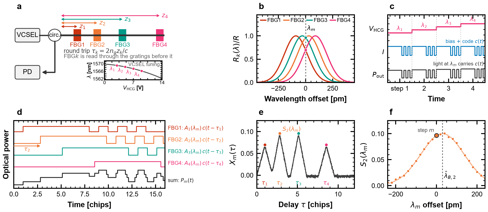
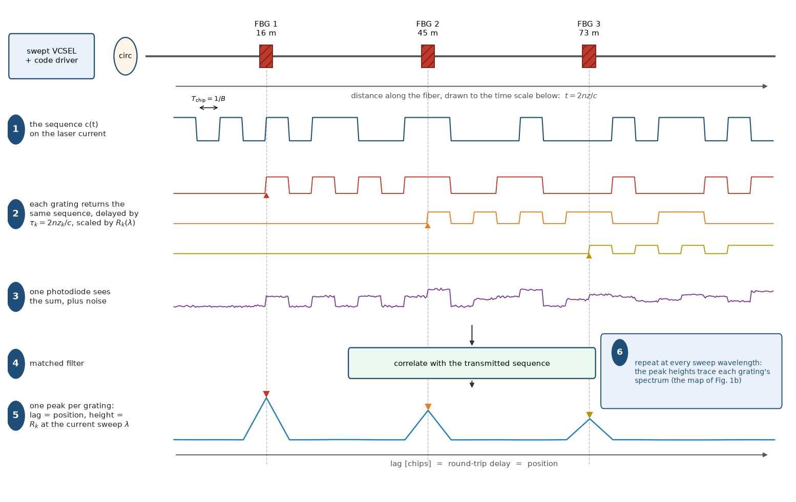
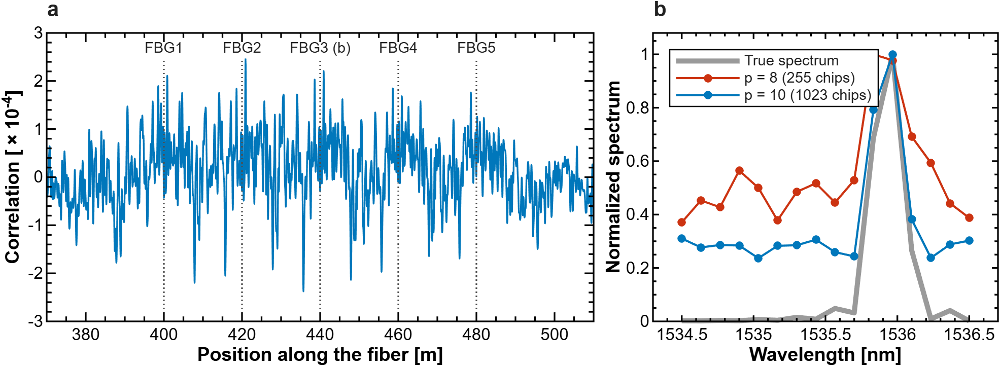
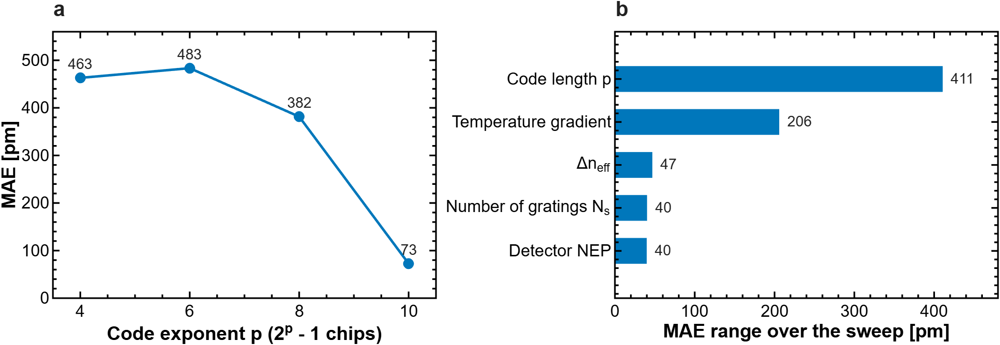
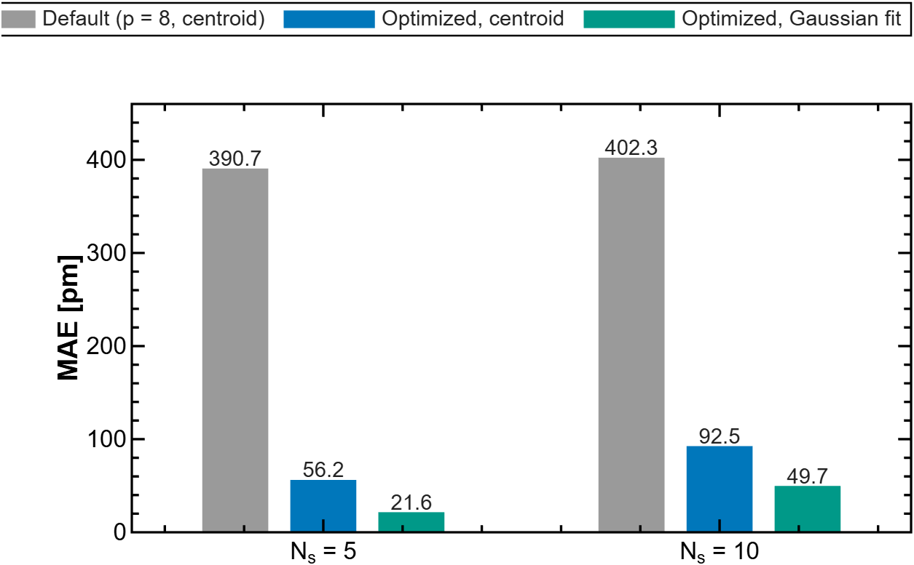

<p align="center">
  
</p>

<h1 align="center">ZPSSC</h1>

<p align="center">
  <strong>Zaawansowane techniki przetwarzania sygnałów w światłowodowych sieciach czujnikowych</strong><br>
  Symulator sieci czujnikowej FBG z multipleksacją kodową (CDM) i badanie symulacyjne układu przesłuchującego siatki z przestrajalnym laserem VCSEL
</p>

<p align="center">
  <a href="https://doi.org/10.5281/zenodo.15089768"></a>
  <a href="https://www.mathworks.com/products/matlab.html"></a>
  <a href="python_selfcal_cdm/"></a>
  <a href="LICENSE"></a>
  <a href="https://matlab.mathworks.com/open/github/v1?repo=juliusz-b/zpssc"></a>
</p>

---

Wiele siatek Bragga na jednym włóknie, wszystkie o tej samej długości fali, odczytywane jednym tanim laserem VCSEL modulowanym sekwencją kodową. Korelacja rozdziela siatki po opóźnieniu, przestrajanie lasera odtwarza widmo każdej z nich. To repozytorium zawiera:

- **Symulator MATLAB** (`src/`, `scripts/`): pełny tor od kodu przez siatki, odbicia wielokrotne i szum fotodetektora do estymacji długości fali Bragga. Na nim wykonano analizę wrażliwości i optymalizację parametrów sieci.
- **Badanie symulacyjne w Pythonie** (`python_selfcal_cdm/`): skrypty do artykułu o samokalibrującym się układzie przesłuchującym CDM (interrogatorze). Reguły projektowe, budżet błędu, pojemność sieci siatek, rodziny kodów, tor akwizycji.

<details>
<summary><strong>English summary</strong></summary>

ZPSSC is a simulation toolkit for fiber Bragg grating (FBG) sensor networks interrogated with code-division multiplexing (CDM). All gratings share one nominal Bragg wavelength and are told apart by the delay of their echo. The MATLAB part models the whole chain (spreading codes, grating spectra, multiple reflections, detector noise, correlation, Bragg-wavelength estimation) and was used for sensitivity analysis and parameter optimization. The Python part is a reproducible simulation study of a self-calibrating CDM interrogator built around a directly modulated, swept VCSEL. Code and comments in `python_selfcal_cdm/` are in English. Funded by the Polish Ministry of Science and Higher Education, Pearls of Science programme, grant PN/01/0321/2022.

</details>

<p align="center">
  <br>
  <em>(a) Tor optyczny i krzywa przestrajania lasera VCSEL. (b) Nakładające się widma siatek. (c) Krok przestrajania i modulacja kodem. (d) Echa z siatek. (e) Korelacja w dziedzinie opóźnienia. (f) Odtworzone widmo jednej siatki.</em>
</p>

## Spis treści

- [Jak to działa](#jak-to-działa)
- [Szybki start](#szybki-start)
- [Struktura repozytorium](#struktura-repozytorium)
- [Symulator MATLAB](#symulator-matlab)
- [Badanie symulacyjne w Pythonie](#badanie-symulacyjne-w-pythonie)
- [Etapy projektu](#etapy-projektu)
- [Cytowanie](#cytowanie)
- [Licencja i finansowanie](#licencja-i-finansowanie)
- [Kontakt](#kontakt)

## Jak to działa

Laser jest modulowany bezpośrednio sekwencją kodową. Każda siatka odbija opóźnioną kopię kodu, fotodetektor widzi ich sumę. Korelacja z wzorcem kodu daje pik na opóźnieniu każdej siatki, a wysokość piku to reflektancja siatki przy bieżącej długości fali lasera. Powolne przestrajanie lasera krok po kroku odtwarza widmo każdej siatki osobno, choć widma nakładają się na osi długości fali.

<p align="center">
  <br>
  <em>Jeden okres kodu. Siatki na 16, 45 i 73 m odbijają opóźnione kopie kodu, fotodetektor widzi sumę z szumem, korelacja zwraca trzy piki na pozycjach siatek.</em>
</p>

## Szybki start

### MATLAB

Wymagany MATLAB R2025b lub nowszy oraz Signal Processing Toolbox i Communications Toolbox. Wybrane skrypty korzystają dodatkowo z Global Optimization Toolbox (`ga`, `particleswarm`), Optimization Toolbox (`lsqcurvefit` w dopasowaniu Gaussa) i Wavelet Toolbox (odszumianie falkowe).

```matlab
AddAllSubfolders;                 % dodaje src/ i scripts/ do ścieżki

params = defaultParams();         % 5 siatek co 20 m, kod Kasami p=8, NEP 15 pW/sqrt(Hz)
params.show_plots = true;
out = runSimulation(params);
fprintf('MAE = %.1f pm\n', out.MAE);       % średni błąd długości fali Bragga
disp(out.lB_errors * 1000);                % błąd każdej siatki [pm]

out_gauss = runSimulationGauss(params);   % estymacja piku dopasowaniem Gaussa
fprintf('MAE (Gauss) = %.1f pm\n', out_gauss.MAE);
```

Parametry symulacji przekazuje się w jednej strukturze. Pola opisane są w nagłówku `src/system/runSimulation.m`, wartości domyślne w `src/system/defaultParams.m`. Struktura `out` zawiera też przebiegi pośrednie: dane w kanale, wynik korelacji i odtworzone widma.

### Python

```bash
cd python_selfcal_cdm
pip install numpy scipy matplotlib
python test_selfcal.py            # 38 sprawdzeń fizyki i numeryki, kod wyjścia != 0 przy błędzie
python s12_capacity.py            # przykładowy skrypt, figury trafiają do figs/
```

## Struktura repozytorium

```
.
├── AddAllSubfolders.m      # dodaje podfoldery do ścieżki MATLAB
├── src/                    # funkcje symulatora MATLAB
│   ├── codes/              # sekwencje kodowe: Kasami, Gold, PRBS, OOC, Golay, Sidelnikov, chaotyczne
│   ├── fbg/                # widma siatek Bragga (model tanh i pełny), odbicia wielokrotne, wyszukiwanie siatek
│   ├── opt_source/         # źródło optyczne: siatka długości fal, model lasera
│   ├── signal/             # szum, korelacja, filtracja, odszumianie, SIC, PSNR
│   ├── system/             # defaultParams, runSimulation, runSimulationGauss, funkcje celu do optymalizacji
│   └── plots/              # wykresy pomocnicze, wspólny styl figur (figStyle)
├── scripts/                # skrypty demonstracyjne i badawcze (WP2, WP3), README_Figures
├── tests/                  # modele VCSEL i próby transmisji (robocze)
├── results/                # figury z symulatora MATLAB (pliki .mat i .fig nie są wersjonowane)
├── python_selfcal_cdm/     # badanie symulacyjne (Python), własne README
│   ├── common.py           # wspólna fizyka: kody, widma FBG, świergot lasera, estymatory, tor akwizycji
│   ├── figstyle.py         # styl figur do publikacji
│   ├── s*_*.py             # skrypty numerowane, każdy generuje jedną figurę lub tabelę
│   ├── figs/               # wygenerowane figury (PDF + PNG)
│   └── out/                # wyniki liczbowe (.npz, .txt)
├── docs/                   # logo programu, figury do README, bibliografia
├── CHANGELOG.md            # historia zmian
└── CITATION.cff            # metadane do cytowania
```

## Symulator MATLAB

Tor symulacji: generacja kodu, modulacja źródła, widma siatek, odbicia (w tym wielokrotne z parametrem `fbg.max_bounces`), sumowanie na fotodetektorze, szum, korelacja z wzorcem kodu i estymacja długości fali Bragga dla każdej siatki. Przesunięcia temperaturowe zadaje wektor `fbg.lambda_shifts`. Widma siatek liczy domyślnie analityczny model tanh, kilka tysięcy razy szybszy od pełnego rozwiązania.

<p align="center">
  <br>
  <em>Co zwraca symulator. (a) Korelacja wzdłuż włókna dla pięciu siatek co 20 m, z szumem detektora NEP 15 pW/√Hz. (b) Widmo siatki FBG3 odtworzone z 16 kroków przestrajania lasera: przy kodzie 255 chipów tło listków sięga połowy piku, przy 1023 chipach spada do jednej czwartej.</em>
</p>

| Skrypt | Co robi |
|--------|---------|
| `scripts/WP2_CodeAnalysis.m` | Właściwości korelacyjne rodzin kodów |
| `scripts/WP2_CodeAnalysis_basics.m` | Skrócona wersja powyższego |
| `scripts/WP2_SystemSimulation.m` | Pełna symulacja toru krok po kroku |
| `scripts/WP2_SystemSimulation_v2.m` | Symulacja przez `runSimulation` z wykresami |
| `scripts/Zadanie1_MultiBounce.m` | Odbicia wielokrotne i echa pozorne |
| `scripts/Zadanie2_TemperatureShift.m` | Gradient temperaturowy wzdłuż szeregu siatek |
| `scripts/Zadanie3_SensitivityAnalysis.m` | Analiza wrażliwości: p, Δn_eff, N_s, NEP, gradient |
| `scripts/Zadanie4_Optimization.m` | Przeszukiwanie siatki p × Δn_eff |
| `scripts/Zadanie4_FullOptimization.m` | Optymalizacja 5 parametrów, GA i PSO |
| `scripts/Zadanie4_GaussOptimization.m` | Optymalizacja z estymacją piku dopasowaniem Gaussa |
| `scripts/Zadanie5_Comparison.m` | Porównanie przed i po optymalizacji |
| `scripts/Zadanie6_BenchmarkCodesDenoising.m` | Kody Kasami i Gold vs metody odszumiania i NEP |
| `scripts/Zadanie_DFE_test.m` | Korektor decyzyjny DFE w torze |
| `scripts/Zadanie_PINvsAPD.m` | Fotodioda PIN vs APD |
| `scripts/Zadanie_TDMvsCDM_Ghosty.m` | Odporność TDM i CDM na echa pozorne z odbić wielokrotnych |
| `scripts/README_Figures.m` | Przerysowuje figury z tego README z zapisanych wyników |

### Co pokazał symulator

**Długość kodu ma największy wpływ na błąd.** Z pięciu przeskanowanych parametrów wydłużenie kodu z 15 do 1023 chipów zmienia błąd o ponad 400 pm, gradient temperaturowy o 200 pm, a głębokość modulacji siatki, liczba siatek i szum detektora po kilkadziesiąt. Dolna granica błędu to deterministyczne listki boczne korelacji, nie szum detektora, więc żadna z ośmiu sprawdzonych metod odszumiania nie pomogła.

<p align="center">
  <br>
  <em>(a) Średni błąd długości fali Bragga w funkcji wykładnika długości kodu. (b) Zakres zmian błędu przy zmianie każdego parametru z osobna w badanym przedziale.</em>
</p>

**Optymalizacja i lepszy estymator.** Optymalizacja GA/PSO pięciu parametrów (Δn_eff, p, próbki na chip, liczba długości fal, rozmieszczenie siatek na osi długości fali) zbija błąd z 391 do 56 pm dla 5 siatek. Zamiana estymatora środka ciężkości (centroidu) na dopasowanie krzywej Gaussa daje kolejny skok do 21,6 pm. We wszystkich wariantach optimum wypadło przy p = 10 i 16 długościach fal.

<p align="center">
  <br>
  <em>Średni błąd dla 5 i 10 siatek: parametry domyślne, po optymalizacji z estymatorem środka ciężkości, po optymalizacji z dopasowaniem krzywej Gaussa.</em>
</p>

| Wynik | Wartość |
|-------|---------|
| MAE, parametry domyślne (N_s = 5, p = 8, środek ciężkości) | 391 pm |
| MAE po optymalizacji, środek ciężkości (N_s = 5 / 10) | 56 pm / 93 pm |
| MAE po optymalizacji, dopasowanie krzywej Gaussa (N_s = 5 / 10) | 21,6 pm / 49,7 pm |
| Kasami vs Gold (ten sam p) | Kasami lepszy o 27 % |
| Odbicia wielokrotne (3 odbicia vs 1) | CDM: zmiana MAE do 15 pm, TDM: do 77 pm |

Pozostałe figury: `results/WP2/benchmark/` i `results/WP3/`.

## Badanie symulacyjne w Pythonie

Folder `python_selfcal_cdm/` to osobny, samowystarczalny zestaw skryptów napisany pod artykuł o układzie przesłuchującym CDM z przestrajalnym laserem VCSEL. Sprzęt jest sparametryzowany zgodnie z makietą projektu (siatki FBGS DTG o szerokości 250 pm i reflektancji 10 %, VCSEL HCG 1550 nm, stanowisko temperaturowe Peltier). Każdy skrypt `sN_*.py` odpowiada jednej figurze lub tabeli i zapisuje wynik do `figs/` lub `out/`. Wspólna fizyka i estymatory są w `common.py`, a `test_selfcal.py` sprawdza granice korelacyjne kodów, estymatory, algebrę opóźnień ech pozornych i wzory toru akwizycji. Opis plików: [`python_selfcal_cdm/README.md`](python_selfcal_cdm/README.md).

Tematy: przesłanianie widmowe siatek przez siatki leżące przed nimi i jego rekurencyjna korekta, pojemność sieci w funkcji reflektancji i rozstawu siatek, rodziny kodów przy przestrajanym źródle nadającym jeden kod naraz (m-sekwencje, Gold, Kasami, pary Golaya), rozstaw siatek wg linijki Golomba przeciw echom pozornym z odbić wielokrotnych, hybryda CDM-WDM, długość kodu jako zmienna projektowa, budżet błędu od źródła do estymaty, próbkowanie ekwiwalentne i wymagania na ADC.

| Wynik | Wartość |
|-------|---------|
| Przesłanianie widmowe przy R = 10 %, 3 siatki / 96 siatek | 8,1 pm / 179 pm |
| Sekwencyjna korekta przesłaniania, makieta 3 siatek | 0,6 pm |
| Pojemność sieci przy R = 10 % (błąd poniżej 10 pm) bez korekty i z korektą | 4 / 17 siatek |
| Rozstaw równomierny vs losowy, K = 32 | 45,0 pm vs 10,4 pm |
| m-sekwencja vs Gold przy przestrajanym źródle, K = 32 | 6,5 pm vs 28,1 pm |
| Budżet błędu: makieta w zakupionej konfiguracji / sieć zaprojektowana | 9,9 pm / 3,3 pm |
| Hybryda CDM-WDM, 32 siatki: 1 pasmo vs 4 × 8 | 60,1 pm vs 22,1 pm |

Wartości pochodzą z symulacji i wymagają potwierdzenia na makiecie (WP4). Figury do artykułu są w `python_selfcal_cdm/figs/`.

## Etapy projektu

| Etap | Zakres | Stan |
|------|--------|------|
| WP1 | Przegląd literatury i analiza rodzin kodów (Kasami, Gold, PRBS, OOC, Sidelnikov, Golay, chaotyczne) | zakończony |
| WP2 | Symulator sieci czujnikowej: tor sygnałowy, odbicia wielokrotne, model temperaturowy, benchmark kodów i odszumiania | zakończony |
| WP3 | Analiza wrażliwości, optymalizacja GA/PSO, porównanie przed i po, reguły projektowe układu przesłuchującego CDM | zakończony |
| WP4 | Makieta pomiarowa: przestrajalny laser VCSEL, tor APD i akwizycja na STM32, stanowisko temperaturowe, walidacja modelu na siatkach FBGS | w trakcie (2026–2027) |

Chronologia zmian w kodzie: [`CHANGELOG.md`](CHANGELOG.md). Literatura, na której oparto WP1: [`docs/BIBLIOGRAFIA.md`](docs/BIBLIOGRAFIA.md).

## Cytowanie

Metadane do cytowania są w [`CITATION.cff`](CITATION.cff) (GitHub pokazuje je w przycisku „Cite this repository"). Wersja archiwalna kodu ma DOI [10.5281/zenodo.15089768](https://doi.org/10.5281/zenodo.15089768).

```bibtex
@software{bojarczuk_zpssc,
  author    = {Bojarczuk, Juliusz},
  title     = {Zaawansowane techniki przetwarzania sygna{\l}{\'o}w w {\'s}wiat{\l}owodowych sieciach czujnikowych (ZPSSC)},
  year      = {2025},
  publisher = {Zenodo},
  doi       = {10.5281/zenodo.15089768},
  url       = {https://github.com/juliusz-b/zpssc}
}
```

## Licencja i finansowanie

Kod udostępniono na licencji [GNU GPL v3](LICENSE).

Projekt „Zaawansowane techniki przetwarzania sygnałów w światłowodowych sieciach czujnikowych" jest finansowany przez Ministerstwo Nauki i Szkolnictwa Wyższego w ramach programu Perły Nauki, umowa nr PN/01/0321/2022. Realizacja: Instytut Telekomunikacji i Cyberbezpieczeństwa, Politechnika Warszawska.

## Kontakt

Juliusz Bojarczuk, [juliusz.bojarczuk@pw.edu.pl](mailto:juliusz.bojarczuk@pw.edu.pl), ORCID [0000-0001-7130-9775](https://orcid.org/0000-0001-7130-9775).

Pytania o kod i propozycje zmian najlepiej zgłaszać przez Issues lub Pull Request w tym repozytorium. Zapraszam do kontaktu jednostki naukowe i firmy zainteresowane sieciami czujnikowymi FBG z multipleksacją kodową.
