<p align="center">
  
</p>

<h1 align="center">ZPSSC</h1>

<p align="center">
  <strong>Zaawansowane techniki przetwarzania sygnałów w światłowodowych sieciach czujnikowych</strong><br>
  Symulator sieci czujnikowej FBG z multipleksacją kodową (CDM) i badanie symulacyjne interrogatora z zamiatanym VCSEL-em
</p>

<p align="center">
  <a href="https://doi.org/10.5281/zenodo.15089768"></a>
  <a href="https://www.mathworks.com/products/matlab.html"></a>
  <a href="python_selfcal_cdm/"></a>
  <a href="LICENSE"></a>
  <a href="https://matlab.mathworks.com/open/github/v1?repo=juliusz-b/zpssc"></a>
</p>

---

Repozytorium zawiera dwa powiązane narzędzia:

- **Symulator MATLAB** (`src/`, `scripts/`): pełny tor sieci czujnikowej z siatkami Bragga adresowanymi kodami rozpraszającymi. Generacja kodów, widma siatek, odbicia wielokrotne, szum fotodetektora, korelacja i estymacja długości fali Bragga. Na tym symulatorze wykonano analizę wrażliwości i optymalizację parametrów sieci (WP2, WP3).
- **Badanie symulacyjne w Pythonie** (`python_selfcal_cdm/`): lekkie, odtwarzalne skrypty do artykułu o samokalibrującej interrogacji CDM z tanim, bezpośrednio modulowanym i przestrajanym laserem VCSEL. Reguły projektowe, budżet błędu, pojemność tablicy siatek, rodziny kodów, tor akwizycji.

<details>
<summary><strong>English summary</strong></summary>

ZPSSC is a simulation toolkit for fiber Bragg grating (FBG) sensor networks interrogated with code-division multiplexing (CDM). The MATLAB part models the whole chain (spreading codes, grating spectra, multiple reflections, detector noise, correlation, Bragg-wavelength estimation) and was used for sensitivity analysis and parameter optimization. The Python part is a reproducible simulation study of a self-calibrating CDM interrogator built around a directly modulated, swept VCSEL: design rules, error budget, array capacity, code families and the acquisition chain. Code and comments in `python_selfcal_cdm/` are in English. The work is funded by the Polish Ministry of Science and Higher Education under the Pearls of Science programme, grant PN/01/0321/2022.

</details>

<p align="center">
  <br>
  <em>Zasada działania: (a) tor optyczny i krzywa strojenia VCSEL, (b) nakładające się widma siatek, (c) krok strojenia i modulacja kodem, (d) echa z siatek, (e) korelacja w dziedzinie opóźnienia, (f) odtworzone widmo jednej siatki.</em>
</p>

## Spis treści

- [Jak to działa](#jak-to-działa)
- [Szybki start](#szybki-start)
- [Struktura repozytorium](#struktura-repozytorium)
- [Symulator MATLAB](#symulator-matlab)
- [Badanie symulacyjne w Pythonie](#badanie-symulacyjne-w-pythonie)
- [Etapy projektu](#etapy-projektu)
- [Cytowanie](#cytowanie)
- [Licencja i finansowanie](#licencja-i-finansowanie)
- [Kontakt](#kontakt)

## Jak to działa

Wszystkie siatki w tablicy mają tę samą nominalną długość fali Bragga, więc ich widma nakładają się. Rozróżnia je tylko opóźnienie echa. Laser VCSEL jest modulowany bezpośrednio sekwencją kodową, a fotodetektor widzi sumę opóźnionych kopii kodu odbitych od kolejnych siatek. Korelacja z wzorcem kodu rozdziela echa w dziedzinie opóźnienia, a wysokość każdego piku to reflektancja danej siatki przy bieżącej długości fali lasera. Powolne przestrajanie lasera krok po kroku odtwarza widmo każdej siatki osobno.

<p align="center">
  <br>
  <em>Jeden okres kodu. Trzy siatki na 16, 45 i 73 m odbijają opóźnione kopie kodu, fotodetektor widzi ich sumę z szumem, a korelacja zwraca trzy piki na pozycjach siatek. Oś opóźnienia jest zarazem osią odległości.</em>
</p>

## Szybki start

### MATLAB

Wymagany MATLAB R2025b lub nowszy oraz Signal Processing Toolbox i Communications Toolbox. Wybrane skrypty korzystają dodatkowo z Global Optimization Toolbox (`ga`, `particleswarm`), Optimization Toolbox (`lsqcurvefit` w dopasowaniu Gaussa) i Wavelet Toolbox (odszumianie falkowe).

```matlab
AddAllSubfolders;                 % dodaje src/ i scripts/ do ścieżki

params = defaultParams();         % 5 siatek, kod Kasami p=8, NEP 15 pW/sqrt(Hz)
params.show_plots = true;
out = runSimulation(params);
fprintf('MAE = %.1f pm\n', out.MAE);

out_gauss = runSimulationGauss(params);   % estymacja piku dopasowaniem Gaussa
fprintf('MAE (Gauss) = %.1f pm\n', out_gauss.MAE);
```

Parametry symulacji przekazuje się w jednej strukturze. Pola opisane są w nagłówku `src/system/runSimulation.m`, wartości domyślne w `src/system/defaultParams.m`.

### Python

```bash
cd python_selfcal_cdm
pip install numpy scipy matplotlib
python test_selfcal.py            # 38 sprawdzeń fizyki i numeryki, kod wyjścia != 0 przy błędzie
python s12_capacity.py            # przykładowy skrypt, figury trafiają do figs/
```

## Struktura repozytorium

```
.
├── AddAllSubfolders.m      # dodaje podfoldery do ścieżki MATLAB
├── src/                    # funkcje symulatora MATLAB
│   ├── codes/              # sekwencje kodowe: Kasami, Gold, PRBS, OOC, Golay, Sidelnikov, chaotyczne
│   ├── fbg/                # widma siatek Bragga (model tanh i pełny), odbicia wielokrotne, wyszukiwanie siatek
│   ├── opt_source/         # źródło optyczne: siatka długości fal, model lasera
│   ├── signal/             # szum, korelacja, filtracja, odszumianie, SIC, PSNR
│   ├── system/             # defaultParams, runSimulation, runSimulationGauss, funkcje celu do optymalizacji
│   └── plots/              # wykresy pomocnicze
├── scripts/                # skrypty demonstracyjne i badawcze (WP2, WP3)
├── tests/                  # modele VCSEL i próby transmisji (robocze)
├── results/                # figury z symulatora MATLAB (pliki .mat i .fig nie są wersjonowane)
├── python_selfcal_cdm/     # badanie symulacyjne (Python), własne README
│   ├── common.py           # wspólna fizyka: kody, widma FBG, chirp, estymatory, tor akwizycji
│   ├── figstyle.py         # styl figur do publikacji
│   ├── s*_*.py             # skrypty numerowane, każdy generuje jedną figurę lub tabelę
│   ├── figs/               # wygenerowane figury (PDF + PNG)
│   └── out/                # wyniki liczbowe (.npz, .txt)
├── docs/                   # logo programu, bibliografia
├── CHANGELOG.md            # historia zmian
└── CITATION.cff            # metadane do cytowania
```

## Symulator MATLAB

Tor symulacji: generacja kodu, modulacja źródła, widma siatek, odbicia (w tym wielokrotne z parametrem `fbg.max_bounces`), sumowanie na fotodetektorze, szum, korelacja z wzorcem kodu i estymacja długości fali Bragga dla każdej siatki. Przesunięcia temperaturowe zadaje wektor `fbg.lambda_shifts`. Widma siatek liczy domyślnie analityczny model tanh, kilka tysięcy razy szybszy od pełnego rozwiązania.

| Skrypt | Co robi |
|--------|---------|
| `scripts/WP2_CodeAnalysis.m` | Właściwości korelacyjne rodzin kodów |
| `scripts/WP2_CodeAnalysis_basics.m` | Skrócona wersja powyższego |
| `scripts/WP2_SystemSimulation.m` | Pełna symulacja toru krok po kroku |
| `scripts/WP2_SystemSimulation_v2.m` | Symulacja przez `runSimulation` z wykresami |
| `scripts/Zadanie1_MultiBounce.m` | Odbicia wielokrotne i sygnały duchowe |
| `scripts/Zadanie2_TemperatureShift.m` | Gradient temperaturowy wzdłuż tablicy |
| `scripts/Zadanie3_SensitivityAnalysis.m` | Analiza wrażliwości: p, Δn_eff, N_s, NEP, gradient |
| `scripts/Zadanie4_Optimization.m` | Przeszukiwanie siatki p × Δn_eff |
| `scripts/Zadanie4_FullOptimization.m` | Optymalizacja 5 parametrów, GA i PSO |
| `scripts/Zadanie4_GaussOptimization.m` | Optymalizacja z estymacją piku dopasowaniem Gaussa |
| `scripts/Zadanie5_Comparison.m` | Porównanie przed i po optymalizacji |
| `scripts/Zadanie6_BenchmarkCodesDenoising.m` | Kody Kasami i Gold vs metody odszumiania i NEP |
| `scripts/Zadanie_DFE_test.m` | Korektor decyzyjny DFE w torze |
| `scripts/Zadanie_PINvsAPD.m` | Fotodioda PIN vs APD |
| `scripts/Zadanie_TDMvsCDM_Ghosty.m` | Odporność TDM i CDM na sygnały duchowe |

### Co pokazał symulator

**Podłoga błędu to listki boczne kodu, nie szum detektora.** Korelacja liczona bez szumu i z szumem NEP 15 pW/√Hz niemal się pokrywa. Sam szum detektora (zielona krzywa na dolnym panelu) jest o rząd mniejszy od listków. To tłumaczy, czemu żadna z ośmiu sprawdzonych metod odszumiania (falki, TVD, Savitzky-Golay i inne) nie poprawiła wyniku.

<p align="center">
  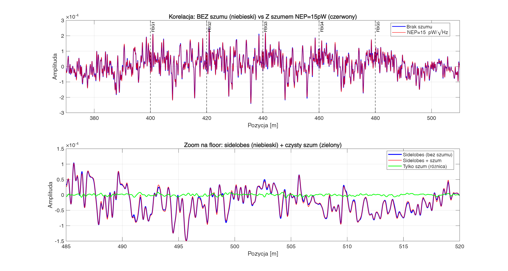
</p>

**Dłuższy kod obniża podłogę.** Przy p = 8 (kod 255 chipów) pik widma siatki ledwo wystaje ponad tło listków, przy p = 10 (1023 chipy) tło spada i pik jest czysty. MAE spada z 410 do 218 pm już przy estymatorze centroidu.

<p align="center">
  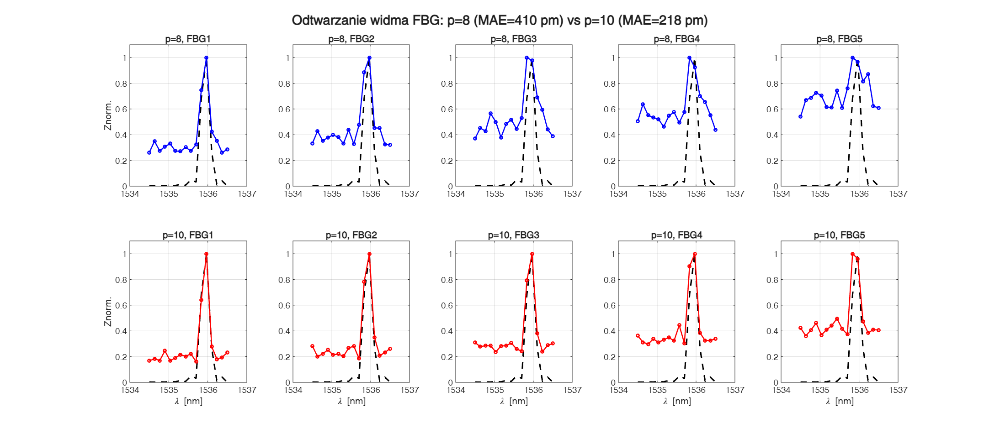
</p>

**Analiza wrażliwości.** Z pięciu parametrów największy wpływ na błąd ma długość kodu, potem gradient temperaturowy wzdłuż tablicy. Głębokość modulacji siatki, liczba siatek i NEP fotodetektora zmieniają MAE o kilkadziesiąt pikometrów, długość kodu o ponad 400.

<p align="center">
  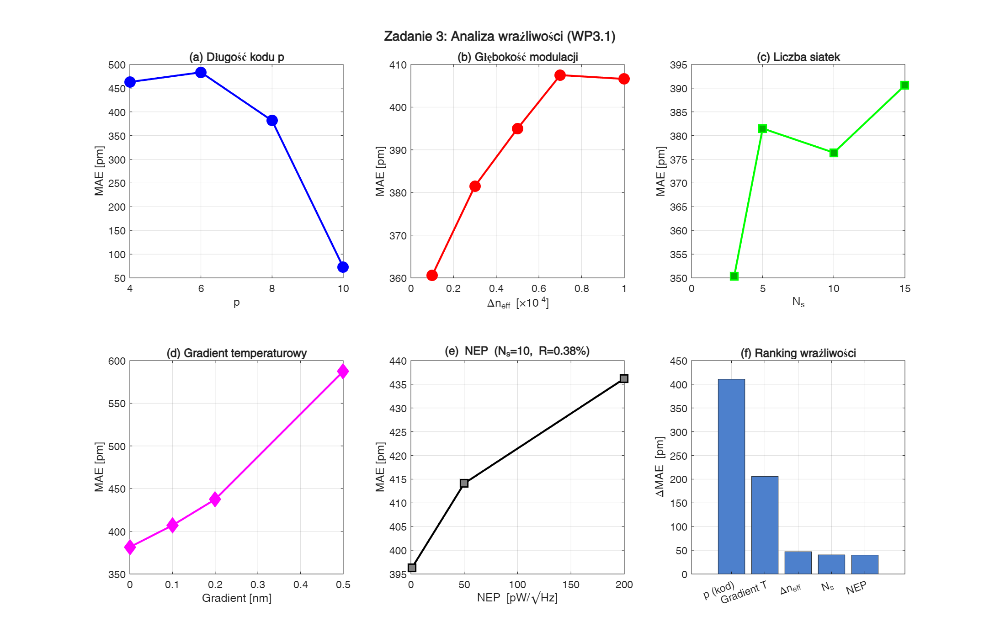
</p>

**Optymalizacja i estymator piku.** Optymalizacja GA/PSO pięciu parametrów (Δn_eff, p, próbki na chip, liczba długości fal, rozłożenie spektralne siatek) zbija MAE z 391 do 56 pm dla 5 siatek. Zamiana centroidu na dopasowanie Gaussa daje kolejny skok do 21,6 pm. Odbicia wielokrotne prawie nie ruszają wyniku w CDM, w TDM zmieniają MAE nawet o 77 pm.

<table align="center">
  <tr>
    <td align="center">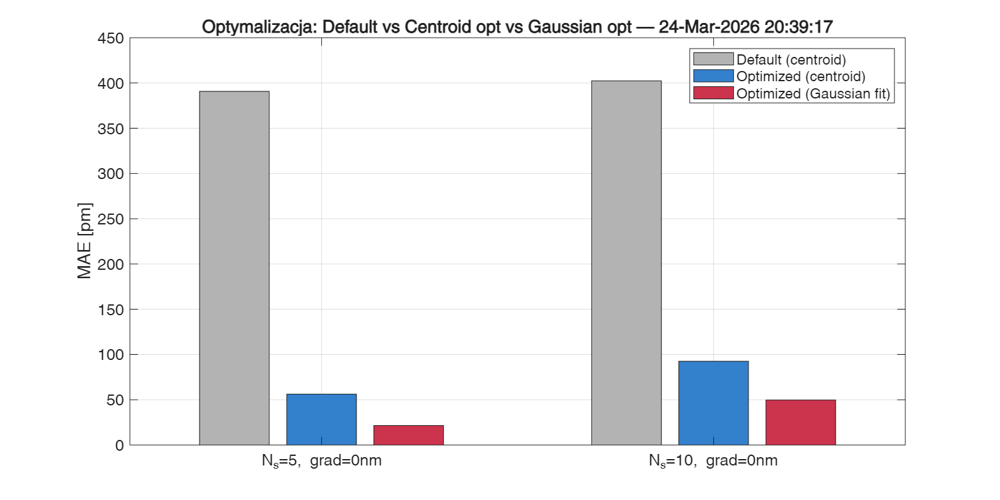</td>
    <td align="center">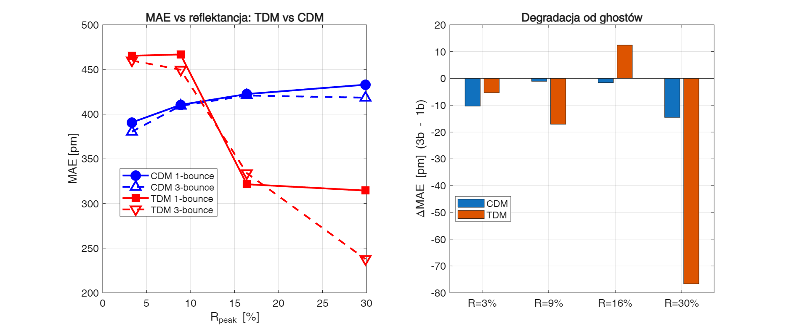</td>
  </tr>
  <tr>
    <td align="center"><em>Domyślne 391 pm, po optymalizacji 56 pm, z dopasowaniem Gaussa 21,6 pm (N_s = 5).</em></td>
    <td align="center"><em>Model 1 i 3 odbić: w CDM różnica do kilkunastu pm, w TDM do 77 pm przy R = 30 %.</em></td>
  </tr>
</table>

| Wynik | Wartość |
|-------|---------|
| MAE detekcji λ_B, parametry domyślne (N_s = 5, p = 8) | 391 pm |
| MAE po optymalizacji, estymator centroidu (N_s = 5 / 10) | 56 pm / 93 pm |
| MAE po optymalizacji, dopasowanie Gaussa (N_s = 5 / 10) | 21,6 pm / 49,7 pm |
| Kasami vs Gold (ten sam p) | Kasami lepszy o 27 % |
| Wydłużenie kodu z p = 8 do p = 10 | MAE 5,3 razy mniejsze |
| Ranking wrażliwości | p ≫ gradient temperaturowy ≫ pozostałe |

Pozostałe figury: `results/WP2/benchmark/` i `results/WP3/`.

## Badanie symulacyjne w Pythonie

Folder `python_selfcal_cdm/` to osobny, samowystarczalny zestaw skryptów napisany pod artykuł o interrogatorze CDM z zamiatanym VCSEL-em. Sprzęt jest sparametryzowany zgodnie z makietą projektu (siatki FBGS DTG o szerokości 250 pm i reflektancji 10 %, VCSEL HCG 1550 nm, stanowisko temperaturowe Peltier). Każdy skrypt `sN_*.py` odpowiada jednej figurze lub jednej tabeli i zapisuje wynik do `figs/` lub `out/`. Wspólna fizyka i estymatory są w `common.py`, a `test_selfcal.py` sprawdza granice korelacyjne kodów, estymatory, algebrę opóźnień ghostów i wzory toru akwizycji. Szczegółowy opis plików: [`python_selfcal_cdm/README.md`](python_selfcal_cdm/README.md).

### Cieniowanie widmowe i pojemność tablicy

Każda siatka jest czytana przez siatki przed nią, więc jej widmo jest zniekształcone iloczynem ich transmisji. Przy R = 10 % już czwarta siatka w rzędzie ma pik przesunięty o 22 pm. Cieniowanie da się odwrócić rekurencyjnie, od pierwszej siatki w głąb, bo transmisja każdej wynika z jej własnego zmierzonego widma. Po korekcie makieta z trzech siatek schodzi do 0,6 pm, a liczba siatek mieszcząca się w progu 10 pm rośnie z 4 do 17.

<table align="center">
  <tr>
    <td align="center">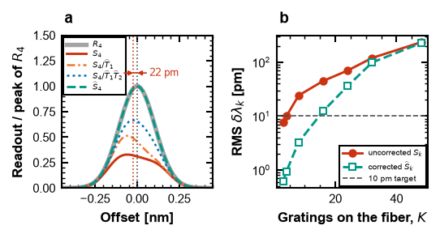</td>
    <td align="center">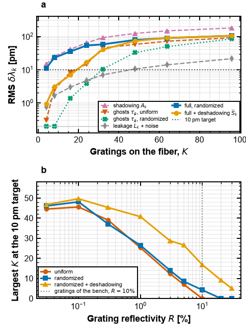</td>
  </tr>
  <tr>
    <td align="center"><em>(a) Widmo czwartej siatki surowe, po kolejnych korektach i odtworzone. (b) Błąd RMS vs liczba siatek bez korekty i z korektą.</em></td>
    <td align="center"><em>(a) Rozkład błędu na mechanizmy: cieniowanie, ghosty, przeciek kodowy z szumem. (b) Największa tablica mieszcząca się w 10 pm vs reflektancja.</em></td>
  </tr>
</table>

### Rodzina kodu i rozstaw siatek

W architekturze zamiatanej nadawany jest jeden kod naraz, więc liczy się autokorelacja, nie korelacja wzajemna. Zwykła m-sekwencja z listkiem 1/N wygrywa z kodami Gold (listek 17/N): 6,5 wobec 28,1 pm przy 32 siatkach. Pary Golaya znoszą listek całkowicie kosztem dwóch akwizycji. Sygnały duchowe trzeciego rzędu trafiają w opóźnienia będące kombinacjami pozycji siatek. Przy rozstawie równomiernym każdy ghost mieszczący się w tablicy ląduje w zajętym binie, rozstaw wg linijki Golomba nie daje ani jednej kolizji, o ile okres kodu jest dłuższy niż rozpiętość tablicy.

<table align="center">
  <tr>
    <td align="center">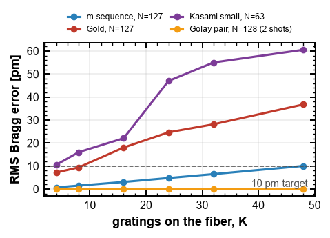</td>
    <td align="center">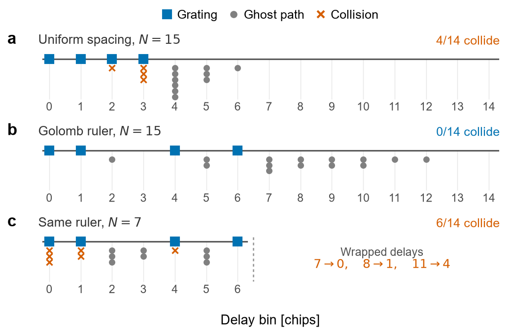</td>
  </tr>
  <tr>
    <td align="center"><em>Błąd RMS vs liczba siatek dla czterech rodzin kodów. Tylko m-sekwencja i para Golaya mieszczą się w 10 pm do K = 48.</em></td>
    <td align="center"><em>Biny opóźnienia zajęte przez siatki i ghosty: rozstaw równomierny (4 kolizje), linijka Golomba (0), ta sama linijka przy za krótkim kodzie (6, ghosty zawijają się modulo N).</em></td>
  </tr>
</table>

### Hybryda CDM-WDM i budżet błędu

Podział tablicy na pasma długości fali resetuje mechanizmy błędu: 32 siatki w jednym paśmie dają 60,1 pm, te same 32 siatki w czterech pasmach po 8 dają 22,1 pm, tyle samo co samotne 8 siatek. Budżet błędu od źródła do estymaty pokazuje, co dominuje w makiecie jak zakupiona (cieniowanie 8,1 pm i chirp lasera 4,8 pm, razem 9,9 pm) i co zostaje w tablicy zaprojektowanej wg reguł z tego badania (3,3 pm, dominują rozdzielczość binu i przeciek kodowy).

<table align="center">
  <tr>
    <td align="center">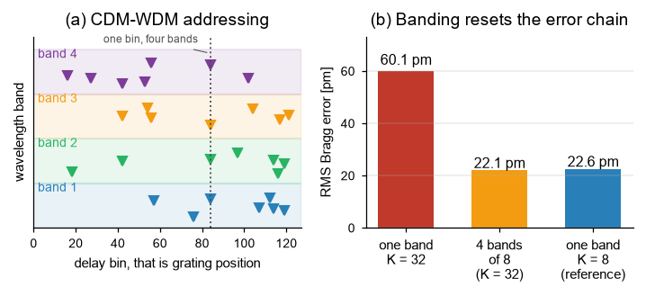</td>
    <td align="center">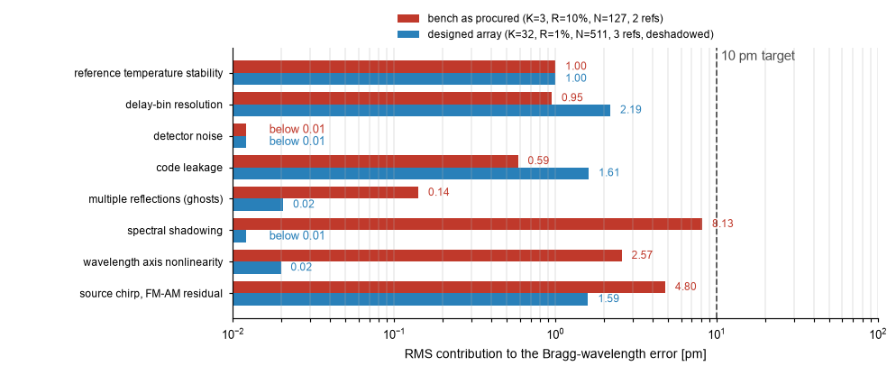</td>
  </tr>
  <tr>
    <td align="center"><em>(a) Siatki adresowane parą pasmo i bin opóźnienia. (b) Jedno pasmo K = 32, cztery pasma po 8, jedno pasmo K = 8.</em></td>
    <td align="center"><em>Udział ośmiu mechanizmów w błędzie RMS długości fali Bragga. Czerwone: makieta (K = 3, R = 10 %, N = 127). Niebieskie: tablica zaprojektowana (K = 32, R = 1 %, N = 511, po odcieniowaniu).</em></td>
  </tr>
</table>

| Wynik | Wartość |
|-------|---------|
| Cieniowanie widmowe przy R = 10 %, 3 siatki / 96 siatek | 8,1 pm / 179 pm |
| Sekwencyjne odcieniowanie, makieta 3 siatek | 0,6 pm |
| Pojemność przy R = 10 % (błąd poniżej 10 pm) bez i z odcieniowaniem | 4 / 17 siatek |
| Rozstaw równomierny vs losowy, K = 32 | 45,0 pm vs 10,4 pm |
| m-sekwencja vs Gold w architekturze zamiatanej, K = 32 | 6,5 pm vs 28,1 pm |
| Budżet błędu: makieta jak zakupiona / tablica zaprojektowana | 9,9 pm / 3,3 pm |
| Hybryda CDM-WDM, 32 siatki: 1 pasmo vs 4 × 8 | 60,1 pm vs 22,1 pm |

Wartości pochodzą z symulacji i wymagają potwierdzenia na makiecie (WP4).

## Etapy projektu

| Etap | Zakres | Stan |
|------|--------|------|
| WP1 | Przegląd literatury i analiza rodzin kodów (Kasami, Gold, PRBS, OOC, Sidelnikov, Golay, chaotyczne) | zakończony |
| WP2 | Symulator sieci czujnikowej: tor sygnałowy, odbicia wielokrotne, model temperaturowy, benchmark kodów i odszumiania | zakończony |
| WP3 | Analiza wrażliwości, optymalizacja GA/PSO, porównanie przed i po, reguły projektowe interrogatora CDM | zakończony |
| WP4 | Makieta pomiarowa: sterownik VCSEL, tor APD i akwizycja, stanowisko temperaturowe, walidacja modelu na siatkach FBGS | w trakcie (2026–2027) |

Makieta WP4 ma trzy siatki FBGS DTG o tej samej długości fali, każdą na osobnym stopniu Peltiera. Dwie służą za referencje o znanej, stabilizowanej temperaturze, trzecia jest czujnikiem. Źródłem jest przestrajany VCSEL HCG modulowany bezpośrednio kodem, odbiornikiem światłowodowa APD InGaAs, a rozplot i kalibrację wykonuje mikrokontroler STM32H7.

<p align="center">
  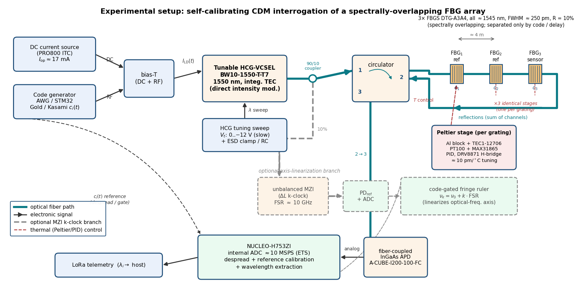<br>
  <em>Schemat stanowiska pomiarowego. Szara gałąź MZI (k-clock) jest opcjonalna i służy do linearyzacji osi długości fali.</em>
</p>

Chronologia zmian w kodzie: [`CHANGELOG.md`](CHANGELOG.md). Literatura, na której oparto WP1: [`docs/BIBLIOGRAFIA.md`](docs/BIBLIOGRAFIA.md).

## Cytowanie

Metadane do cytowania są w [`CITATION.cff`](CITATION.cff) (GitHub pokazuje je w przycisku „Cite this repository"). Wersja archiwalna kodu ma DOI [10.5281/zenodo.15089768](https://doi.org/10.5281/zenodo.15089768).

```bibtex
@software{bojarczuk_zpssc,
  author    = {Bojarczuk, Juliusz},
  title     = {Zaawansowane techniki przetwarzania sygna{\l}{\'o}w w {\'s}wiat{\l}owodowych sieciach czujnikowych (ZPSSC)},
  year      = {2025},
  publisher = {Zenodo},
  doi       = {10.5281/zenodo.15089768},
  url       = {https://github.com/juliusz-b/zpssc}
}
```

## Licencja i finansowanie

Kod udostępniono na licencji [GNU GPL v3](LICENSE).

Projekt „Zaawansowane techniki przetwarzania sygnałów w światłowodowych sieciach czujnikowych" jest finansowany przez Ministerstwo Nauki i Szkolnictwa Wyższego w ramach programu Perły Nauki, umowa nr PN/01/0321/2022. Realizacja: Instytut Telekomunikacji i Cyberbezpieczeństwa, Politechnika Warszawska.

## Kontakt

Juliusz Bojarczuk, [juliusz.bojarczuk@pw.edu.pl](mailto:juliusz.bojarczuk@pw.edu.pl), ORCID [0000-0001-7130-9775](https://orcid.org/0000-0001-7130-9775).

Pytania o kod i propozycje zmian najlepiej zgłaszać przez Issues lub Pull Request w tym repozytorium. Zapraszam do kontaktu jednostki naukowe i firmy zainteresowane sieciami czujnikowymi FBG z multipleksacją kodową.
